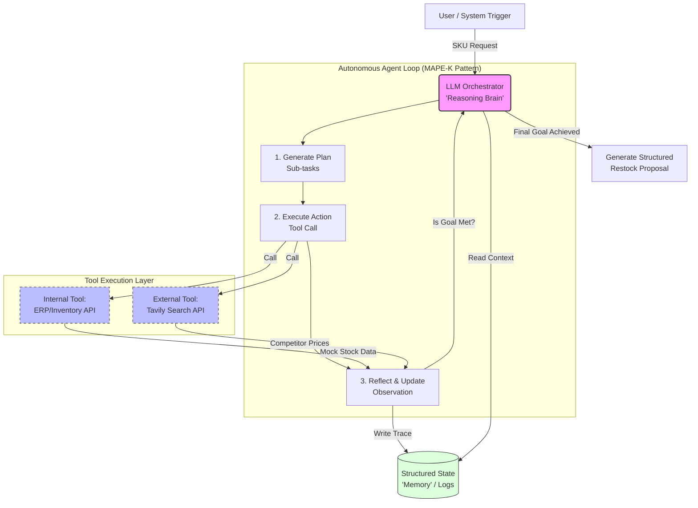

# ecommerceERP — Autonomous Inventory Management Agent

A LangGraph-powered **Plan → Act → Reflect** agent that analyses internal ERP
inventory data, fetches competitor market intelligence via Tavily, and produces
a structured restock proposal with full auditability.

---

## Setup

> Requires **Python 3.10+**. A `.venv` is created in the project root.

```bash
# 1. Clone / enter the repo
cd ecommerceERP

# 2. Create and activate the virtual environment
python -m venv .venv
source .venv/bin/activate          # Windows: .venv\Scripts\activate

# 3. Install the package and all dependencies (runtime + dev)
pip install -e ".[dev]"

# 4. Configure secrets
cp .env.example .env
# Open .env and set TAVILY_API_KEY if you want live market research.
# Leave TAVILY_MOCK=true to run fully offline with mock data (recommended first).
```

---

## Running the agent

### Offline / mock mode (no API key needed)

```bash
# Analyse a low-stock SKU — triggers the full Plan→Act→Reflect loop
# including the market-research branch (stock < 20%)
TAVILY_MOCK=true ecommerce-erp --sku SKU-001

# Analyse a healthy-stock SKU — skips market research
TAVILY_MOCK=true ecommerce-erp --sku SKU-003
```

### Live Tavily mode (requires `TAVILY_API_KEY` in `.env`)

```bash
# .env must contain: TAVILY_API_KEY=tvly-...  and  TAVILY_MOCK=false
source .venv/bin/activate
ecommerce-erp --sku SKU-004
```

### Available mock SKUs

| SKU     | Product                       | Stock % | Triggers market research? |
| ------- | ----------------------------- | ------- | ------------------------- |
| SKU-001 | Wireless Bluetooth Headphones | 7.5%    | ✅ yes                    |
| SKU-002 | USB-C Charging Cable (2m)     | 20.0%   | ❌ no (boundary)          |
| SKU-003 | Ergonomic Office Chair        | 80.0%   | ❌ no                     |
| SKU-004 | Mechanical Keyboard           | 10.0%   | ✅ yes                    |
| SKU-005 | Smart Home Hub                | 35.0%   | ❌ no                     |

### Output

The agent prints:

1. A **human-readable Markdown proposal** showing the Safety Stock calculation table and market adjustment.
2. A **machine-readable JSON proposal** with every field needed for downstream automation.
3. A `⚠️ ACTION REQUIRED: Awaiting Human Approval` pause message before any order is "placed".

The full **reasoning trace** is written as JSONL to `logs/reasoning_trace.log`.
Each line contains `timestamp`, `phase` (PLAN / ACT / REFLECT), `thought`, `action`, and `observation`.

```bash
# Tail the live trace while the agent runs (open a second terminal)
tail -f logs/reasoning_trace.log | python -m json.tool
```

---

## Running the Streamlit demo (Phase 1)

This phase is intentionally public-facing and does not include authentication.

```bash
# Make sure dependencies are installed
source .venv/bin/activate
pip install -e ".[dev]"

# Launch the Streamlit UI
TAVILY_MOCK=true python -m streamlit run src/ecommerce_erp/ui/app.py
```

Open the local URL shown by Streamlit (usually http://localhost:8501).

### Demo workflow

1. Select a SKU in the sidebar.
2. Toggle mock mode on/off.
3. Click Run analysis.
4. Observe live PLAN → ACT → REFLECT trace updates.
5. Review output in Markdown and JSON tabs.
6. Use Approve or Reject to simulate human-in-the-loop decisioning.

---

## Deploy to Streamlit Community Cloud (now)

Use this for immediate public demo hosting.

### 1. Push code to GitHub

Ensure these files are in your repository:

- `streamlit_app.py`
- `requirements.txt`
- `runtime.txt`

### 2. Create the app in Streamlit Cloud

1. Open Streamlit Community Cloud and click **New app**.
2. Select your GitHub repo and branch.
3. Set **Main file path** to `streamlit_app.py`.
4. Click **Deploy**.

### 3. Configure app secrets (recommended)

In app settings, open **Secrets** and add one of these options:

```toml
# Option A: demo-safe mock mode (no API key needed)
TAVILY_MOCK = "true"
```

```toml
# Option B: live market research
TAVILY_MOCK = "false"
TAVILY_API_KEY = "your_real_key"
```

Do not commit `.env` or real API keys to git.

### 4. Verify after deployment

1. Open the hosted app URL.
2. Run `SKU-001` in mock mode.
3. Confirm you see:

- live PLAN → ACT → REFLECT steps,
- Markdown and JSON proposal tabs,
- approval buttons and status update.

### Troubleshooting

- If import errors occur, confirm **Main file path** is exactly `streamlit_app.py`.
- If market calls fail in live mode, verify `TAVILY_API_KEY` in Secrets.
- If app appears stale, use **Reboot app** from Streamlit settings.

---

## Running the FastAPI service (Phase 2/3)

The API layer now supports:

- run orchestration endpoints,
- approval decision submission,
- approval audit-history reads,
- configurable persistence backend (`sqlite` or `postgres`),
- an auth-protected runtime config endpoint (`/api/v1/config`).

### Start the API locally

```bash
source .venv/bin/activate
pip install -e ".[dev]"

# Example: SQLite backend
export API_DB_BACKEND=sqlite
export API_DB_PATH=.data/api_runs.db
export API_AUTH_ENABLED=false

ecommerce-erp-api
```

### Typical local dev profiles

Profile A: Fast local iteration (SQLite + auth off)

```bash
source .venv/bin/activate
export API_DB_BACKEND=sqlite
export API_DB_PATH=.data/api_runs.db
export API_AUTH_ENABLED=false
export TAVILY_MOCK=true

ecommerce-erp-api
```

Profile B: Production-like local testing (Postgres + auth on)

```bash
source .venv/bin/activate
export API_DB_BACKEND=postgres
export API_POSTGRES_DSN='postgresql://<user>:<pass>@localhost:5432/ecommerce_erp'
export API_AUTH_ENABLED=true
export API_BASIC_AUTH_USER=<api_user>
export API_BASIC_AUTH_PASS=<api_pass>
export TAVILY_MOCK=true

ecommerce-erp-api
```

Optional quick check in either profile:

```bash
curl -s http://localhost:8000/healthz | python -m json.tool
```

### Checklist: SQLite-based instance

1. Activate environment and install dependencies.
2. Set `API_DB_BACKEND=sqlite`.
3. Set `API_DB_PATH` to your desired file path (for example `.data/api_runs.db`).
4. Decide auth mode:
   - local-only: `API_AUTH_ENABLED=false`
   - shared env: `API_AUTH_ENABLED=true` and set `API_BASIC_AUTH_USER` / `API_BASIC_AUTH_PASS`
5. Start API with `ecommerce-erp-api`.
6. Verify health: `GET /healthz`.
7. Verify active backend: `GET /api/v1/config` and confirm:
   - `db_backend` is `sqlite`
   - `db_target` matches your SQLite path.
8. Run one analysis and approve once to confirm persistence:
   - `POST /api/v1/analyze`
   - `POST /api/v1/analyze/{run_id}/decision`
   - `GET /api/v1/analyze/{run_id}/approval-history`

### Checklist: Postgres-based instance

1. Ensure Postgres is running (local install or Docker Desktop container).
2. Create database (example name: `ecommerce_erp`).
3. Apply the bootstrap SQL in `db/bootstrap/001_phase3_persistence.sql`.
4. Set `API_DB_BACKEND=postgres`.
5. Set `API_POSTGRES_DSN` in this format:
   - `postgresql://<user>:<pass>@<host>:<port>/<db_name>`
6. Ensure the schema already exists before starting the API.
7. Decide auth mode:
   - local-only: `API_AUTH_ENABLED=false`
   - shared env: `API_AUTH_ENABLED=true` and set `API_BASIC_AUTH_USER` / `API_BASIC_AUTH_PASS`
8. Start API with `ecommerce-erp-api`.
9. Verify health: `GET /healthz`.
10. Verify active backend: `GET /api/v1/config` and confirm:

- `db_backend` is `postgres`
- `db_target` shows sanitized host/port/db only (no credentials).

11. Run one analysis and approve once, then verify audit trail:

- `GET /api/v1/analyze/{run_id}/approval-history` returns at least one decision event.

Example Docker Desktop Postgres quick start:

```bash
docker run --name ecommerce-erp-pg \
  -e POSTGRES_USER=postgres \
  -e POSTGRES_PASSWORD=postgres \
  -e POSTGRES_DB=ecommerce_erp \
  -p 5432:5432 \
  -d postgres:16
```

Apply the bootstrap SQL locally with `psql`:

```bash
psql "postgresql://<user>:<pass>@localhost:54322/ecommerce_erp" -f db/bootstrap/001_phase3_persistence.sql
```

Optional ownership transfer for least-privilege app role (`erp_app`):

```bash
# Run as a sufficiently privileged role (for example postgres)
psql "postgresql://<admin_user>:<admin_pass>@<host>:<port>/<db_name>" \
  -f db/bootstrap/002_transfer_ownership_to_erp_app.sql
```

This migration only touches ecommerceERP persistence objects:
`runs`, `approval_events`, and `approval_events_id_seq`.
Use it for local or self-managed Postgres. For Supabase Cloud, keep ownership as-is
and grant runtime privileges instead.

Optional helper scripts for quick CLI connection:

```bash
# Local Postgres (prefers LOCAL_POSTGRES_DSN, falls back to API_POSTGRES_DSN)
export LOCAL_POSTGRES_DSN='postgresql://erp_app:<password>@localhost:54322/postgres'
./scripts/connect-local-db

# Supabase Cloud (prefers CLOUD_POSTGRES_DSN or SUPABASE_POSTGRES_DSN)
export CLOUD_POSTGRES_DSN='postgresql://erp_app:<password>@<project-ref>.supabase.co:5432/postgres'
./scripts/connect-cloud-db
```

`connect-cloud-db` automatically appends `sslmode=require` when missing.

Cloud API smoke test helper:

```bash
# Assumes ecommerce-erp-api is running locally against Supabase Cloud Postgres
./scripts/smoke-cloud-api

# If API auth is enabled
export API_BASIC_AUTH_USER='<api_user>'
export API_BASIC_AUTH_PASS='<api_pass>'
./scripts/smoke-cloud-api
```

The smoke test validates: `/healthz`, `/api/v1/config` (`db_backend=postgres`),
run creation, approval decision, and approval-history.

Apply the same SQL to Supabase Cloud:

1. Open the Supabase SQL Editor.
2. Paste the contents of `db/bootstrap/001_phase3_persistence.sql`.
3. Run it once in the target project.

This keeps local Docker and Supabase Cloud on the same Phase 3 schema.

### Quick endpoint list

- `GET /healthz`
- `GET /api/v1/config`
- `POST /api/v1/analyze`
- `GET /api/v1/analyze/{run_id}`
- `GET /api/v1/analyze/{run_id}/proposal`
- `POST /api/v1/analyze/{run_id}/decision`
- `GET /api/v1/analyze/{run_id}/approval-history`

### `/api/v1/config` examples

Auth disabled (`API_AUTH_ENABLED=false`):

```bash
curl -s http://localhost:8000/api/v1/config | python -m json.tool
```

Auth enabled (`API_AUTH_ENABLED=true`):

```bash
curl -s \
  -u "<api_user>:<api_pass>" \
  http://localhost:8000/api/v1/config | python -m json.tool
```

Expected shape:

```json
{
  "db_backend": "sqlite",
  "db_target": ".data/api_runs.db"
}
```

For Postgres backend, `db_target` is intentionally sanitized and excludes user/password/query params.

---

## Productization roadmap

### Phase 1 (current): Public Streamlit demo

- Completed: interactive UI + live reasoning trace + dual output + approval simulation.

### Phase 2: Service/API layer + auth

- Completed: FastAPI backend with analyze/proposal/decision endpoints.
- Completed: optional basic auth for protected API routes.

### Phase 3: Persistence + audit

- Completed: persistent run/proposal storage with backend switch (`sqlite`/`postgres`).
- Completed: approval audit history endpoint.

### Phase 4: Dockerization

- Add production Dockerfile(s) and docker-compose.
- Add health checks, env-based config, non-root runtime user.

### Phase 5: Enterprise deployment (AWS-first)

- Preferred path for popularity and speed:
  - Containers on ECS Fargate or App Runner.
  - ALB + ACM + Route53 for HTTPS and DNS.
  - Secrets Manager for API keys.
  - CloudWatch for logs/metrics/alarms.

- Azure remains a strong option when your stack is Microsoft-first or needs
  tighter Entra ID integration, but AWS is the practical default for broad
  ecosystem familiarity.

---

## Running the tests

```bash
# Run the full suite (44 tests, all offline — no API key required)
pytest

# With coverage report
pytest --cov=ecommerce_erp --cov-report=term-missing

# Run a specific test module
pytest tests/test_orchestrator.py -v
pytest tests/test_recommendation_engine.py -v
pytest tests/test_guardrails.py -v
pytest tests/test_tools.py -v
```

All tests enforce `TAVILY_MOCK=true` automatically via `tests/conftest.py`, so
no live API calls are ever made during `pytest`.

### What the tests cover

| File                            | What is tested                                                                                              |
| ------------------------------- | ----------------------------------------------------------------------------------------------------------- |
| `test_orchestrator.py`          | Full Plan→Act→Reflect loop, low/healthy/boundary stock branches, cost-guard integration, JSONL trace format |
| `test_recommendation_engine.py` | Safety Stock math (exact values), market adjustment factors, dual JSON+Markdown output                      |
| `test_guardrails.py`            | Cost-guard limits, custom env override, error message content                                               |
| `test_tools.py`                 | Inventory mock data, case-insensitive SKU lookup, Tavily mock/live switching, missing API key handling      |
| `test_smoke.py`                 | Full CLI entry point (`main()`) returns exit code 0                                                         |

---

## Dockerization (Phase 4 Slice A)

Phase 4 now includes a production-oriented API image with:

- multi-stage build,
- non-root runtime user,
- env-driven configuration,
- container health check against `/healthz`.

### Build the API image

```bash
docker build -t ecommerce-erp-api:local .
```

### Run with SQLite

```bash
docker run --rm \
  -p 8000:8000 \
  -e API_DB_BACKEND=sqlite \
  -e API_DB_PATH=/app/.data/api_runs.db \
  -e API_AUTH_ENABLED=false \
  -e TAVILY_MOCK=true \
  -v ecommerce_erp_sqlite:/app/.data \
  ecommerce-erp-api:local
```

### Run with Postgres

Apply `db/bootstrap/001_phase3_persistence.sql` first, then start the container:

```bash
docker run --rm \
  -p 8000:8000 \
  -e API_DB_BACKEND=postgres \
  -e API_POSTGRES_DSN='postgresql://<user>:<pass>@<host>:<port>/<db_name>?sslmode=require' \
  -e API_AUTH_ENABLED=false \
  -e TAVILY_MOCK=true \
  ecommerce-erp-api:local
```

### Container health

```bash
docker ps
docker inspect --format='{{json .State.Health}}' <container_name> | python -m json.tool
curl -s http://localhost:8000/healthz | python -m json.tool
```

Notes:

- The container does not create Postgres tables at runtime.
- For SQLite mode, persist `/app/.data` with a named volume or bind mount.
- Secrets stay in environment variables; do not bake them into the image.

## Docker Compose (Phase 4 Slice B)

Phase 4 Slice B adds a local multi-service workflow in `docker-compose.yml` with:

- `api-sqlite` for API + SQLite persistence,
- `postgres` + `api-postgres` for API + local Postgres bootstrap,
- `streamlit` for the Streamlit demo.

### SQLite profile

```bash
docker compose up --build api-sqlite
```

Defaults:

- API at `http://localhost:8000`
- SQLite data persisted in the named volume `sqlite_data`
- logs persisted in the named volume `api_logs`

### Postgres profile

```bash
docker compose --profile postgres up --build api-postgres postgres
```

Defaults:

- API at `http://localhost:8000`
- Postgres at `localhost:5432`
- database/user/password default to `ecommerce_erp` / `postgres` / `postgres`
- bootstrap SQL from `db/bootstrap/001_phase3_persistence.sql` runs automatically on first init

Optional overrides:

```bash
POSTGRES_DB=mydb POSTGRES_USER=myuser POSTGRES_PASSWORD=mypassword \
API_POSTGRES_PORT=8001 POSTGRES_PORT=5433 \
docker compose --profile postgres up --build api-postgres postgres
```

If you reuse an existing `postgres_data` volume, the bootstrap SQL will not re-run. In that case either apply the SQL manually or recreate the volume.

### Streamlit profile

```bash
docker compose --profile streamlit up --build streamlit
```

Defaults:

- Streamlit at `http://localhost:8501`
- health endpoint at `http://localhost:8501/_stcore/health`

### Shutdown and cleanup

```bash
docker compose down
docker compose down -v
```

Use `down -v` only when you want to remove the named SQLite/Postgres volumes.

## Docker CI (Phase 4 Slice C)

Slice C adds a GitHub Actions workflow that:

- runs a direct Docker smoke lane for SQLite,
- runs a Docker Compose smoke lane for Postgres,
- waits for `/healthz` before each smoke test,
- captures container/compose logs on failure.

Workflow file:

- `.github/workflows/docker-slice-c.yml`

Smoke test script used by CI:

- `scripts/smoke-api`

### Run the Slice C smoke test locally

```bash
docker build -t ecommerce-erp-api:local .

docker run -d --name ecommerce-erp-api-local-smoke \
  -p 18000:8000 \
  -e API_DB_BACKEND=sqlite \
  -e API_DB_PATH=/app/.data/api_runs.db \
  -e API_AUTH_ENABLED=false \
  -e TAVILY_MOCK=true \
  ecommerce-erp-api:local

API_BASE_URL=http://127.0.0.1:18000 API_EXPECTED_BACKEND=sqlite ./scripts/smoke-api

docker rm -f ecommerce-erp-api-local-smoke
```

The smoke script validates: `/healthz`, `/api/v1/config`, run creation, approval decision, and approval-history persistence.

---

## Environment variables

| Variable                   | Default             | Description                                              |
| -------------------------- | ------------------- | -------------------------------------------------------- |
| `TAVILY_API_KEY`           | —                   | Required for live market research. Get one at tavily.com |
| `TAVILY_MOCK`              | `false`             | Set `true` for fully offline mock mode                   |
| `MAX_TOOL_CALLS_PER_CYCLE` | `5`                 | Cost-guard cap — halts the loop if exceeded              |
| `LOG_DIR`                  | `./logs`            | Directory where `reasoning_trace.log` is written         |
| `API_HOST`                 | `0.0.0.0`           | FastAPI bind host                                        |
| `API_PORT`                 | `8000`              | FastAPI bind port                                        |
| `API_AUTH_ENABLED`         | `false`             | Enable HTTP basic auth on API routes                     |
| `API_BASIC_AUTH_USER`      | `admin`             | Username for API basic auth                              |
| `API_BASIC_AUTH_PASS`      | `change_me`         | Password for API basic auth                              |
| `API_DB_BACKEND`           | `sqlite`            | Persistence backend: `sqlite` or `postgres`              |
| `API_DB_PATH`              | `.data/api_runs.db` | SQLite DB file path when backend is `sqlite`             |
| `API_POSTGRES_DSN`         | —                   | Postgres DSN when backend is `postgres`                  |

---

# The Project

## Agentic ERP Integration & Restock Optimization

### The Concept

A multi-agent system where:

- One agent analyzes sales data (from a mock ERP)
- Another researches market trends
- A third generates a restock strategy.

**Technical Twist:** Use a framework like CrewAI or LangGraph to manage complex state and "agentic" workflows.

---

## The Problem

Inventory management in large-scale e-commerce is often reactive. Human managers spend hours correlating internal sales velocity with external market trends to decide on restock orders.

---

## The Solution

An autonomous multi-agent system that "thinks" through inventory challenges by accessing internal databases and external market APIs.

---

## Key Features

- **Agentic Orchestration:** Uses a state-machine approach (LangGraph) to manage complex, multi-step tasks.
- **Functional Tool-Calling:** The agent is empowered to call Python functions to query ERP systems (Netsuite/Spanner) and search the web for competitor pricing.
- **Context-Aware Reasoning:** The agent doesn't just suggest a number; it provides a "Reasoning Trace" explaining why it suggested a specific restock amount based on lead times and sales trends.
- **Human-in-the-Loop:** Generates a draft proposal that requires human approval via a UI/Slack integration before any orders are "placed."

---

## Tech Stack

- **Framework:** LangGraph
- **UI:** Streamlit
- **Search Tool:** Tavily / Perplexity API
- **Database:** Simulated Spanner/SQL via Python Tooling

---

### System Design Diagram


