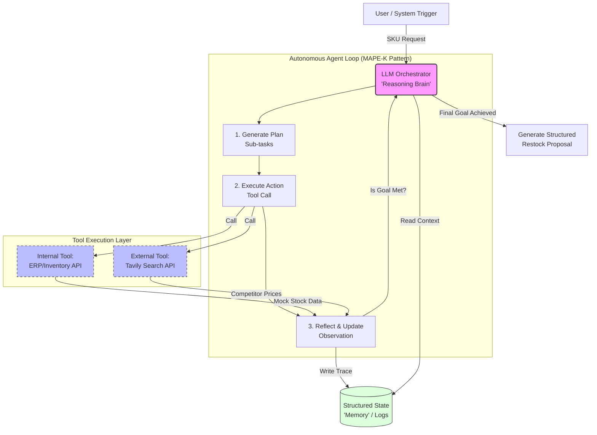

# ecommerceERP — Autonomous Inventory Management Agent

A LangGraph-powered **Plan → Act → Reflect** agent that analyses internal ERP
inventory data, fetches competitor market intelligence via Tavily, and produces
a structured restock proposal with full auditability.

---

## Setup

> Requires **Python 3.10+**. A `.venv` is created in the project root.

```bash
# 1. Clone / enter the repo
cd ecommerceERP

# 2. Create and activate the virtual environment
python -m venv .venv
source .venv/bin/activate          # Windows: .venv\Scripts\activate

# 3. Install the package and all dependencies (runtime + dev)
pip install -e ".[dev]"

# 4. Configure secrets
cp .env.example .env
# Open .env and set TAVILY_API_KEY if you want live market research.
# Leave TAVILY_MOCK=true to run fully offline with mock data (recommended first).
```

---

## Running the agent

### Offline / mock mode (no API key needed)

```bash
# Analyse a low-stock SKU — triggers the full Plan→Act→Reflect loop
# including the market-research branch (stock < 20%)
TAVILY_MOCK=true ecommerce-erp --sku SKU-001

# Analyse a healthy-stock SKU — skips market research
TAVILY_MOCK=true ecommerce-erp --sku SKU-003
```

### Live Tavily mode (requires `TAVILY_API_KEY` in `.env`)

```bash
# .env must contain: TAVILY_API_KEY=tvly-...  and  TAVILY_MOCK=false
source .venv/bin/activate
ecommerce-erp --sku SKU-004
```

### Available mock SKUs

| SKU     | Product                       | Stock % | Triggers market research? |
| ------- | ----------------------------- | ------- | ------------------------- |
| SKU-001 | Wireless Bluetooth Headphones | 7.5%    | ✅ yes                    |
| SKU-002 | USB-C Charging Cable (2m)     | 20.0%   | ❌ no (boundary)          |
| SKU-003 | Ergonomic Office Chair        | 80.0%   | ❌ no                     |
| SKU-004 | Mechanical Keyboard           | 10.0%   | ✅ yes                    |
| SKU-005 | Smart Home Hub                | 35.0%   | ❌ no                     |

### Output

The agent prints:

1. A **human-readable Markdown proposal** showing the Safety Stock calculation table and market adjustment.
2. A **machine-readable JSON proposal** with every field needed for downstream automation.
3. A `⚠️ ACTION REQUIRED: Awaiting Human Approval` pause message before any order is "placed".

The full **reasoning trace** is written as JSONL to `logs/reasoning_trace.log`.
Each line contains `timestamp`, `phase` (PLAN / ACT / REFLECT), `thought`, `action`, and `observation`.

```bash
# Tail the live trace while the agent runs (open a second terminal)
tail -f logs/reasoning_trace.log | python -m json.tool
```

---

## Running the tests

```bash
# Run the full suite (44 tests, all offline — no API key required)
pytest

# With coverage report
pytest --cov=ecommerce_erp --cov-report=term-missing

# Run a specific test module
pytest tests/test_orchestrator.py -v
pytest tests/test_recommendation_engine.py -v
pytest tests/test_guardrails.py -v
pytest tests/test_tools.py -v
```

All tests enforce `TAVILY_MOCK=true` automatically via `tests/conftest.py`, so
no live API calls are ever made during `pytest`.

### What the tests cover

| File                            | What is tested                                                                                              |
| ------------------------------- | ----------------------------------------------------------------------------------------------------------- |
| `test_orchestrator.py`          | Full Plan→Act→Reflect loop, low/healthy/boundary stock branches, cost-guard integration, JSONL trace format |
| `test_recommendation_engine.py` | Safety Stock math (exact values), market adjustment factors, dual JSON+Markdown output                      |
| `test_guardrails.py`            | Cost-guard limits, custom env override, error message content                                               |
| `test_tools.py`                 | Inventory mock data, case-insensitive SKU lookup, Tavily mock/live switching, missing API key handling      |
| `test_smoke.py`                 | Full CLI entry point (`main()`) returns exit code 0                                                         |

---

## Environment variables

| Variable                   | Default  | Description                                              |
| -------------------------- | -------- | -------------------------------------------------------- |
| `TAVILY_API_KEY`           | —        | Required for live market research. Get one at tavily.com |
| `TAVILY_MOCK`              | `false`  | Set `true` for fully offline mock mode                   |
| `MAX_TOOL_CALLS_PER_CYCLE` | `5`      | Cost-guard cap — halts the loop if exceeded              |
| `LOG_DIR`                  | `./logs` | Directory where `reasoning_trace.log` is written         |

---

# The Project

## Agentic ERP Integration & Restock Optimization

### The Concept

A multi-agent system where:

- One agent analyzes sales data (from a mock ERP)
- Another researches market trends
- A third generates a restock strategy.

**Technical Twist:** Use a framework like CrewAI or LangGraph to manage complex state and "agentic" workflows.

---

## The Problem

Inventory management in large-scale e-commerce is often reactive. Human managers spend hours correlating internal sales velocity with external market trends to decide on restock orders.

---

## The Solution

An autonomous multi-agent system that "thinks" through inventory challenges by accessing internal databases and external market APIs.

---

## Key Features

- **Agentic Orchestration:** Uses a state-machine approach (LangGraph) to manage complex, multi-step tasks.
- **Functional Tool-Calling:** The agent is empowered to call Python functions to query ERP systems (Netsuite/Spanner) and search the web for competitor pricing.
- **Context-Aware Reasoning:** The agent doesn't just suggest a number; it provides a "Reasoning Trace" explaining why it suggested a specific restock amount based on lead times and sales trends.
- **Human-in-the-Loop:** Generates a draft proposal that requires human approval via a UI/Slack integration before any orders are "placed."

---

## Tech Stack

- **Framework:** LangGraph / CrewAI
- **Search Tool:** Tavily / Perplexity API
- **Database:** Simulated Spanner/SQL via Python Tooling

---

### System Design Diagram


