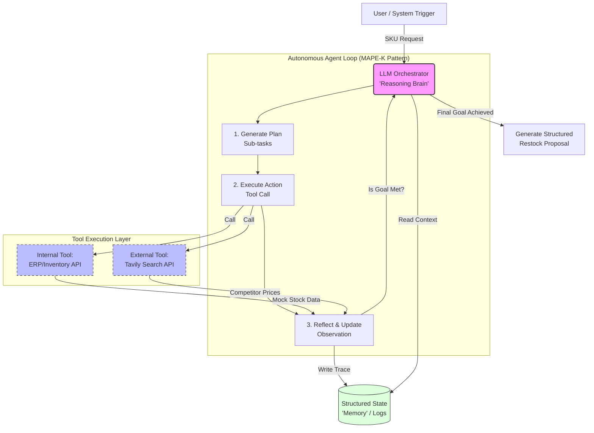

# ecommerceERP

Minimal Python application scaffold.

## Quick start

```bash
python -m venv .venv
source .venv/bin/activate
pip install -e .
ecommerce-erp
```

## Run without installation

```bash
PYTHONPATH=src python -m ecommerce_erp.main
```

# The Project

## Agentic ERP Integration & Restock Optimization

### The Concept

A multi-agent system where:

- One agent analyzes sales data (from a mock ERP)
- Another researches market trends
- A third generates a restock strategy.

**Technical Twist:** Use a framework like CrewAI or LangGraph to manage complex state and "agentic" workflows.

---

## The Problem

Inventory management in large-scale e-commerce is often reactive. Human managers spend hours correlating internal sales velocity with external market trends to decide on restock orders.

---

## The Solution

An autonomous multi-agent system that "thinks" through inventory challenges by accessing internal databases and external market APIs.

---

## Key Features

- **Agentic Orchestration:** Uses a state-machine approach (LangGraph) to manage complex, multi-step tasks.
- **Functional Tool-Calling:** The agent is empowered to call Python functions to query ERP systems (Netsuite/Spanner) and search the web for competitor pricing.
- **Context-Aware Reasoning:** The agent doesn't just suggest a number; it provides a "Reasoning Trace" explaining why it suggested a specific restock amount based on lead times and sales trends.
- **Human-in-the-Loop:** Generates a draft proposal that requires human approval via a UI/Slack integration before any orders are "placed."

---

## Tech Stack

- **Framework:** LangGraph / CrewAI
- **Search Tool:** Tavily / Perplexity API
- **Database:** Simulated Spanner/SQL via Python Tooling

---

### System Design Diagram


